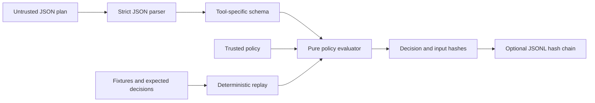

# TraceGate

**A deterministic policy gate and audit/replay harness for structured tool plans.**

An agent proposes three operations: read a project note, fetch Python documentation, and write a review. TraceGate validates the entire JSON plan, checks each operation against an explicit policy, and emits a reproducible decision. A path traversal, a look-alike hostname, an unknown argument, or an oversized request makes the plan fail.

TraceGate is a **planning and policy-evaluation library**. It does not execute tools, provide an operating-system sandbox, or make a model trustworthy. The `approve` outcome means that a proposal passed the configured checks; it is not a human approval credential.

## Run in under a minute

Requires Python 3.11 or newer. No runtime dependencies, service accounts, network access, or API keys are needed. Run these commands from this repository:

```bash
python3 -m tracegate evaluate fixtures/plans/docs-review.json
python3 -m tracegate evaluate fixtures/plans/docs-review.json --approve
python3 -m tracegate evaluate fixtures/plans/blocked-export.json
```

The first plan returns `dry-run`, the second returns `approve`, and the third returns `reject` with exit code `2`. None performs the proposed reads, writes, or HTTP requests.

Run the checks and reproduce the included evaluation:

```bash
python3 -m unittest discover -s tests -v
python3 -m tracegate replay fixtures/cases.json --output artifacts/evaluation.json
```

Local validation on CPython 3.11.15: **50 unit/integration tests passed; 25/25 replay cases matched their expected outcomes and reason codes.** Each replay case is evaluated twice and compared byte-for-byte. These are deliberately selected local cases, not a completeness proof, benchmark, or production reliability claim. See [the evaluation output](artifacts/evaluation.json) and [validation record](artifacts/validation.json). CI installs the package and tests Python 3.11–3.13; its remote status must be checked after publishing.

For a shell command instead of `python3 -m tracegate`, optionally install the package:

```bash
python3 -m pip install .
tracegate --version
```

Installation may download the build backend; running directly from the repository does not require it.

## The contract

```json
{
  "schema_version": 1,
  "plan_id": "review-a-note",
  "steps": [
    {
      "id": "read-note",
      "tool": "file.read",
      "args": {"path": "workspace/notes/project.md", "max_bytes": 4096}
    }
  ]
}
```

Every field is required. Unknown fields, unknown tools, duplicate step IDs, duplicate JSON keys, non-finite numbers, and invalid Unicode fail validation. `true` is not accepted where an integer is required. The parser caps input files at 2 MiB; plans contain 1–128 steps before the policy's tighter limit is applied.

| Tool | Required arguments | Default policy |
| --- | --- | --- |
| `file.read` | `path`, `max_bytes` | Under `workspace/`; at most 65,536 bytes requested |
| `file.write` | `path`, `content`, `overwrite` | Under `workspace/`; at most 32,768 UTF-8 bytes; no overwrite |
| `http.request` | `url`, `method`, `timeout_ms`, `max_response_bytes` | HTTPS; exact host `docs.python.org` or `api.github.com`; GET/HEAD; 10 seconds; 262,144 bytes |

Paths use a deliberately narrow relative ASCII format. Comparisons use complete path components, so `workspace-backup/` is outside `workspace/`. Traversal, absolute paths, backslashes, encoded path segments, and trailing spaces/dots are rejected. This is a lexical check; it does not inspect real files or resolve symlinks.

URL checks reject credentials, fragments, whitespace, control characters, non-ASCII URLs, non-HTTPS schemes, and non-default ports. Hosts match exactly after the URL parser's hostname case normalization. Subdomains and hostname suffixes do not implicitly inherit access. Configured hosts require a final DNS label beginning with a letter; this excludes IP literals, including legacy numeric forms such as `127.1` and `0x7f.0.0.1`. An allowed hostname still requires runtime DNS, redirect, and connection checks in any executor.

Policy is versioned and strictly validated in [policy.json](policy.json). Empty allowlists deny that category. The CLI default resolves `policy.json` relative to the current directory; pass `--policy /path/to/policy.json` elsewhere.

## Decisions and reproducibility

The report contains:

- `outcome`: `dry-run`, `approve`, or `reject`.
- `errors`: plan-level schema or step-budget failures.
- `checks`: each step's `pass`/`reject` status and stable reason codes.
- `plan_sha256` and `policy_sha256`: hashes binding the decision to its inputs.

A malformed plan produces no step checks. A schema-valid plan gets all applicable policy checks, and any rejection rejects the whole plan. A `pass` step inside a rejected plan is not permission to execute part of the plan.

Canonical JSON sorts object keys, uses compact separators, preserves array order, rejects non-finite numbers, and encodes UTF-8. Policy allowlists are normalized into sorted lists. Reports contain no clock, random identifier, environment lookup, filesystem result, DNS result, or model response. The same plan, normalized policy, and mode produce the same report. This encoding is project-specific; it does not claim compliance with a cross-language canonical JSON standard.

```python
from tracegate import evaluate_plan, load_policy
from tracegate.jsonio import load_json

policy = load_policy("policy.json")
plan = load_json("fixtures/plans/docs-review.json")
decision = evaluate_plan(plan, policy)
assert decision["outcome"] == "dry-run"
```

## Audit and verification

```bash
python3 -m tracegate evaluate fixtures/plans/docs-review.json --audit artifacts/run.jsonl
python3 -m tracegate verify-audit artifacts/run.jsonl
```

The decision stays on stdout. The audit receipt, including the latest hash, goes to stderr. Store that hash in a separate trusted location if you want to detect later truncation or rewriting:

```bash
python3 -m tracegate verify-audit artifacts/run.jsonl --expected-head YOUR_SAVED_64_CHARACTER_SHA256
```

Each canonical JSONL record contains a sequence number, the previous record hash, a decision payload, and its SHA-256 hash. Verification checks formatting, sequence, links, and record content. Appending verifies the existing chain first, uses an exclusive lock file for cooperating writers, and flushes the new record to disk. A crashed writer can leave a `.lock` file; confirm no writer is active before removing a stale lock. Partial writes fail closed. Chains are capped at 64 MiB and must be rotated manually.

**A hash chain is not a signature.** Without an independently trusted head, deleting a valid tail or recomputing the entire chain can still produce an internally valid chain. Tests explicitly demonstrate both limitations. There is no authenticated writer identity, trusted timestamp, or automatic checkpoint storage.

The CLI audits decisions and input hashes, excluding raw tool arguments such as file content and URLs. Plan IDs, step IDs, and diagnostic strings can still contain caller-provided information; this is not a secret-redaction system. The public `append_report` API expects trusted `evaluate_plan` output and checks only its top-level shape. Protect log storage according to the sensitivity of the supplied metadata.

## Replay evaluation

[fixtures/cases.json](fixtures/cases.json) declares 25 cases with explicit expected decisions and reason codes. It includes valid plans, traversal, platform-specific path syntax, prefix collisions, misleading hosts, embedded URL credentials, loopback URLs, malformed types, unknown arguments, method restrictions, overwrite attempts, UTF-8 size boundaries, and step budgets.

Replay performs two pure evaluations per case, verifies their byte equality, and compares the outcome and complete reason-code set with the fixture. Changing an expectation to the wrong outcome produces a failed case and process exit `1`. The output records hashes for the suite, policy, and individual reports. Raw-JSON parser attacks such as duplicate object keys are covered by unit tests because a parsed fixture cannot preserve duplicate keys.

The [portfolio lab](https://steve5829.github.io/personal-website/lab.html) displays recorded Python outputs for these cases. It is a static result viewer, not a browser reimplementation of the gate. Recreate its data snapshot with:

```bash
python3 scripts/export_lab.py --output artifacts/lab.json
```

| Exit | Meaning |
| --- | --- |
| `0` | Policy-passing plan, passing suite, or verified chain |
| `1` | Fixture expectation or determinism mismatch |
| `2` | Plan rejected; also argparse usage errors |
| `3` | Input/configuration/IO error |
| `4` | Invalid audit chain or occupied audit lock |

## Architecture and threat model



| Boundary | What this implementation covers | What an integration still needs |
| --- | --- | --- |
| Plan parser | Known fields and tools, exact primitive types, basic input bounds | Process-level resource isolation for hostile workloads |
| File proposals | Canonical relative paths and component allowlists | Root-relative file handles, symlink protection, race-safe opens, platform rules |
| Network proposals | Exact DNS-name allowlist, method/scheme/port/size declarations | Resolved-address validation, redirect rechecking, DNS rebinding defenses, enforced streaming limits |
| Approval | Deterministic policy decision bound to plan/policy digests | Authenticated human approval if required; prevention of post-check plan mutation |
| Audit | Linked records and optional checkpoint comparison | Trusted external head storage, access controls, signatures, retention and recovery |

The attacker may control the plan. Policy files, Python code, and interpreter are trusted. A compromised executor or host is outside the model. String content inside an allowed file write is treated as data; this gate does not interpret or detect prompt injection, malicious code, or sensitive content. Requested timeout/byte limits are checked as declarations only, because there is no executor. Identical accepted operations may be repeated across plans; there is no cumulative spending budget or rate limiter.

See the standalone [threat model](docs/threat-model.md) for assumptions and integration requirements.

Source layout: `schema.py` defines shape/type checks, `policy.py` loads configuration, `engine.py` is the pure decision function, `audit.py` verifies and appends records, `replay.py` evaluates fixtures, and `cli.py` connects them. Tests exercise API behavior, adversarial inputs, tampering, and CLI exit codes.

## Provenance

Created in September 2026 as a new portfolio project for Steve Chen. The initial implementation, tests, fixtures, and documentation were scaffolded with OpenAI Codex. No private project implementation was copied. The included validation describes local execution; this repository makes no claims of external adoption, production deployment, or independently audited security. [Resume-ready descriptions](RESUME_BULLETS.md) are limited to the implementation and measured checks.

MIT licensed.
